# Comparativo de Estruturas Narrativas

## 1. Introdução
A escolha da estrutura narrativa adequada pode impactar diretamente na eficiência e no engajamento da história contada. Diferentes abordagens se adequam melhor a certos gêneros, públicos e plataformas, tornando essencial entender suas principais características e aplicações.

## 2. Objetivo
Este documento visa comparar as principais estruturas narrativas, destacando suas características, vantagens, desvantagens e casos de uso ideais. Também inclui um fluxograma mermaid para auxiliar na escolha da estrutura mais apropriada.

## 3. Público-alvo
- Roteiristas e escritores
- Criadores de conteúdo
- Profissionais de marketing
- Pesquisadores de narrativas

## 4. Comparativo das Estruturas Narrativas

| Estrutura | Características | Melhor Uso | Desvantagens |
|-----------|-----------------|------------|--------------|
| **Jornada do Herói** | Estrutura clássica em 12 passos para histórias de superação. | Ficção, cinema, mitologia. | Pode ser previsível. |
| **Save the Cat** | Foco em batidas específicas do roteiro para engajamento. | Cinema, storytelling de marca. | Pode ser limitante para histórias experimentais. |
| **Sete Pontos** | Modelo simples e direto com 7 momentos principais. | Literatura, narrativas curtas. | Pode não capturar nuances complexas. |
| **Pirâmide de Freytag** | Estrutura de cinco atos que enfatiza clímax. | Teatro, tragédias. | Pode ser lenta para formatos curtos. |
| **Círculo de Histórias** | Baseia-se em padrões cíclicos e repetição. | Mitos, storytelling cultural. | Pode parecer repetitivo. |
| **Curva de Fichtean** | Múltiplas tensões ascendentes para manter interesse. | Suspense, thrillers. | Pode ser cansativo se mal utilizado. |
| **Efeito Rashomon** | Mostra eventos sob diferentes perspectivas. | Histórias não lineares, investigação. | Difícil de executar bem. |
| **Sobreposição de Narrativas** | Várias histórias interligadas. | Filmes corais, narrativas complexas. | Pode confundir o público. |
| **In Media Res** | Começa a história no meio da ação. | Filmes de ação, narrativas rápidas. | Pode gerar confusão inicial. |
| **Falso Começo** | Introduz uma falsa premissa antes da verdadeira história. | Mistério, terror. | Risco de frustração do público. |
| **Convergência de Ideias** | Histórias paralelas que se unem. | Ficção científica, drama. | Pode exigir planejamento detalhado. |
| **A Montanha** | Estrutura simples com foco na escalada de desafios. | Contos, narrativas curtas. | Menos complexidade narrativa. |
| **Pétalas** | Histórias conectadas em uma estrutura modular. | Narrativas interativas, experiências digitais. | Difícil de estruturar. |
| **Sparklines** | Alternação entre altos e baixos emocionais. | Discursos, storytelling corporativo. | Pode parecer manipulação emocional. |

## 5. Guia de Escolha da Estrutura Narrativa
Para facilitar a escolha da estrutura narrativa ideal, utilize o fluxograma abaixo:

```mermaid
graph TD;
    A[Qual o objetivo da história?] --> B[Desenvolvimento do protagonista]
    A --> C[História envolvente e comercial]
    A --> D[História baseada em tensão e conflito]
    A --> E[Perspectivas múltiplas e interligadas]
    A --> F[Impacto inicial forte]
    A --> G[Estruturas simples e modulares]

    subgraph "Desenvolvimento do Protagonista"
        B --> B1[Superação de desafios] --> B11[Jornada do Herói]
        B --> B2[Evolução emocional] --> B12[Pirâmide de Freytag]
    end

    subgraph "História Envolvente e Comercial"
        C --> C1[Estrutura de roteiro] --> C11[Save the Cat]
        C --> C2[Narrativa clara e concisa] --> C12[Sete Pontos]
    end

    subgraph "História Baseada em Tensão e Conflito"
        D --> D1[Escalada progressiva] --> D11[Curva de Fichtean]
        D --> D2[Momentos de altos e baixos emocionais] --> D12[Sparklines]
    end

    subgraph "Perspectivas Múltiplas e Interligadas"
        E --> E1[Pontos de vista divergentes] --> E11[Efeito Rashomon]
        E --> E2[Histórias interligadas] --> E12[Sobreposição de Narrativas]
        E --> E3[Tramas paralelas convergindo] --> E13[Convergência de Ideias]
    end

    subgraph "Impacto Inicial Forte"
        F --> F1[Ação imediata] --> F11[In Media Res]
        F --> F2[Surpreender o público] --> F12[Falso Começo]
    end

    subgraph "Estruturas Simples e Modulares"
        G --> G1[Ritmo gradual] --> G11[A Montanha]
        G --> G2[Narrativa modular] --> G12[Pétalas]
    end
```

